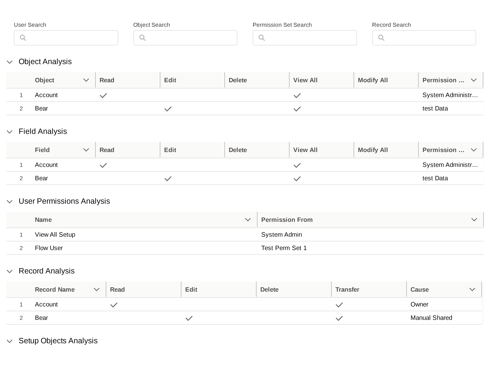

## Backend
Core currently is based on single user and their profiles and permissions for object and setup level security.

For record level security currently only owd and share rows should suffice.

### Object and Setup Level Security

We will be listing `pure functions/methods/apis` for making system decoupled and easy to scale. 

#### Flow
1. Once we get `User` , we will grab its `profile` and related `permissionSet`s using `PermissionSetAssignment`
1. `PermissionSetAssignment` lets us know `user` and `permissionSet` linking
1. `select id,Assignee.Username,  PermissionSet.IsOwnedByProfile  from PermissionSetAssignment `
1. For provided `user` ids all the `permissionSets` will be listed down. Grabbing all the permissionSets will help us query granular level access for objects.

---
1. `ObjectPermissions` we will use this in combination with `permissionSet` ids to query for all the permissions available for user's permission set and profile 
1. Similarly `fieldPermissions` for field related data

## Front End

Upon looking into market place available apps , found that apps focus on lots of things in a single app.

We want app which only focuses on user , its permissions and how they got it.

There are cool features like 
1. Search permissions by user
1. Search User by permission [the sf permissions like View all data , flow user etc ]
1. Search User by source [profile or permset or group]

UI and UX is what could provide MOAT to current implementation.

rather than focusing on complex components , data table and filtering should be enough to get overview of permission analysis.

Here is mockup 

