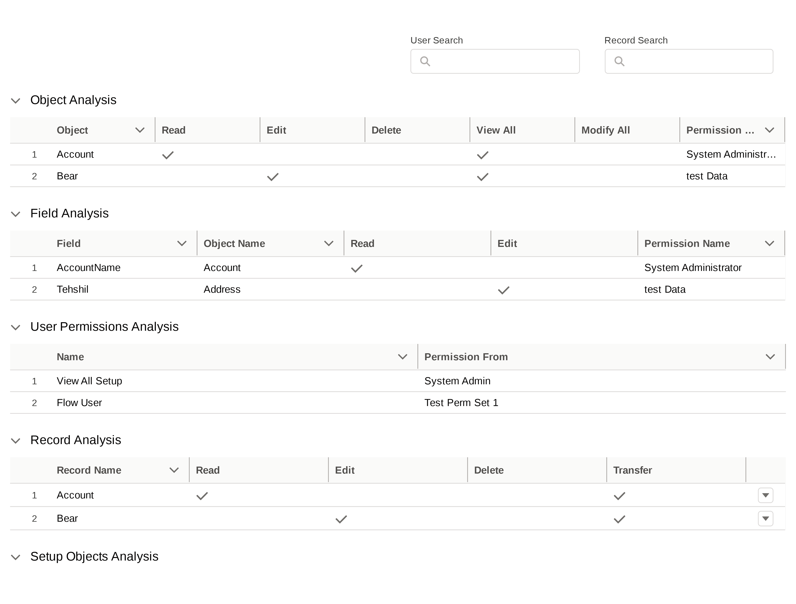
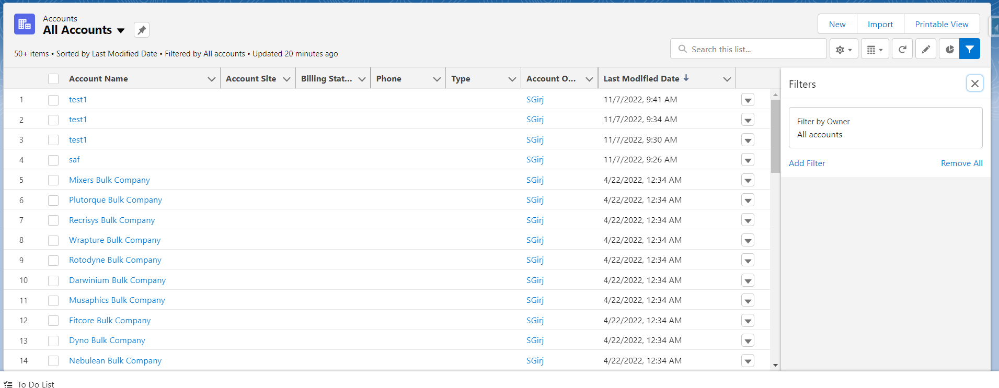

# Salesforce-Permission-Debugger
Hello world !!, Instead of finishing old incomplete projects like a good boi. 
Here is ANOTHER new repository which I will now be committing to [at least for 2 days i hope 😑]. 
Please go through Readme and Questions file to contribute. See you maybe on another repo 👋.

## Problem Statement OR Why this new repo ?
You are a very awesome developer , Creator and manager of lots and lots of awesome and super complex feature. 
Production involves lot of user specific issues.

For an instance ,

There comes a day when you are debugging where the user is getting permission from. 
1. is it from profile ?
1. is it from permission set 1 ?
1. is it from permission set 99 ? [world wants reusable permission sets so not even exaggeration on number 99] ?
1. is it from owd / someone manually provided sharing access ?
1. is it MAGIC ? 
you wont know unless you waste your time checking all of the above.

Another instance could be , you want to know if user has access to some apex class or not ?
There are mostly 2 ways to find out 
1. Go to profile and check apex class's permission
1. Listen for debug logs and find your error there.

In Summary we want to know how a given user is getting record level access from ?
and what are user's security level accesses

---
## Backend
Core currently is based on single user and their profiles and permissions for object and setup level security.

For record level security currently only owd and share rows should suffice.

### Object and Setup Level Security

We will be listing `pure functions/methods/apis` for making system decoupled and easy to scale. 

#### Flow
1. Once we get `User` , we will grab its `profile` and related `permissionSet`s using `PermissionSetAssignment`
1. `PermissionSetAssignment` lets us know `user` and `permissionSet` linking
1. `select id,Assignee.Username,  PermissionSet.IsOwnedByProfile  from PermissionSetAssignment `
1. For provided `user` ids all the `permissionSets` will be listed down. Grabbing all the permissionSets will help us query granular level access for objects.

---
1. `ObjectPermissions` we will use this in combination with `permissionSet` ids to query for all the permissions available for user's permission set and profile 
1. Similarly `fieldPermissions` for field related data

## Front End

#### Market Comparison and MOAT
Upon looking into market place available apps , found that apps focus on lots of things in a single app.

We want app which only focuses on user , its permissions and how they got it.

There are cool features like 
1. Search permissions by user
1. Search User by permission [the sf permissions like View all data , flow user etc ]
1. Search User by source [profile or permset or group]

UI and UX is what could provide MOAT to current implementation.

rather than focusing on complex components , data table and filtering should be enough to get overview of permission analysis.

#### General Principles 
1. Target Audience for this tool is `Developers` and  `Admins`.
1. Data dumping to client side will always be preferred way of handling rows of data.
1. In case where there are query limitations we will be using client side pagination to fetch more rows.
1. Idea is to present all data and user will decide what to look for. 
1. Datatable searches will be looping over all the columns of that table.
1. UI Shall be kept as minimal as possible.
1. Datatable to have only 10 rows per section
1. Hyper links are expected where data can be sensibly linked.
1. Accordion sections will be kept visible once user is selected. Even if there are no rows or data to be displayed. Sections will be kept visible. 
1. All front end components will be of lwc

#### Idea / Mockup

#### UX

1. Initial load
    1. On initial load , No rows should be displayed and user should be prompted to search for user
    1. all the other items should either be hidden / disabled or have filler/placeholder text inside.
1. User Search
    1. Provides list of all users.
    1. Upon selection following should happen
        1. Object analysis to be displayed with 10 rows.
        1. Record Search to be enabled
1. Record Search [Still not clear]
    1. Main idea is to show row level access of the user 
    1. and a button which provides deeper dive of 
        1. Share Records
        1. OWD
        1. View All
        1. Modify All
        1. Descriptive text of possibilities
1. Analysis Tables
    1. Table should be displayed along with filters
    1. Smart filter like SF provides should be implemented to filter over columns
    1. Load More / Next
    1. Previous buttons to be provided
    1. Export to CSV Feature to be implemented